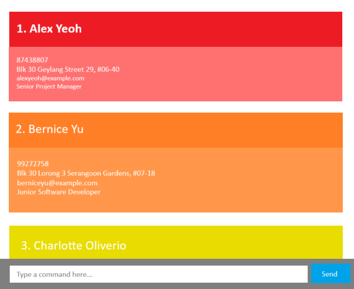

# HireHive
[](https://github.com/se-edu/addressbook-level3/actions)



## Overview
HireHive is a desktop application designed for small companies to efficiently track job candidates, manage interview notes, and streamline the hiring process.

**Target users:** HR and recruitment managers for companies.

### **Key Features**
- **Track Interview Stages & Notes** – Keep detailed records of interviews and past communications.
- **Bookmark Potential Candidates** – Mark standout applicants for future consideration.
- **Categorize Candidates** – Filter candidates by job role and recruitment stage.

### Running our application:
1. Download our latest release (.jar or executable file).
2. In your terminal, run ```java -jar HireHive.jar```
3. Enjoy :)

For the detailed documentation of this project, see the [HireHive Product Website](https://github.com/AY2425S2-CS2103T-F13-3/tp)
This project is based on the AddressBook-Level3 project created by the [SE-EDU initiative](https://se-education.org).
This project is a part of the se-education.org initiative. If you would like to contribute code to this project, see [se-education.org](https://se-education.org/#contributing-to-se-edu) for more info.


