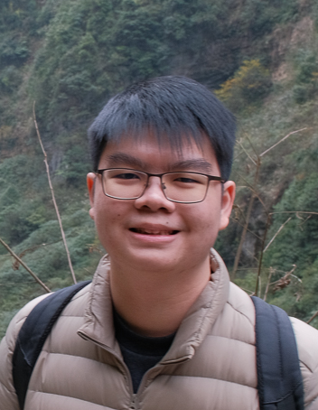

We are a team based in the [School of Computing, National University of Singapore](https://www.comp.nus.edu.sg).

You can reach us at the email `seer[at]comp.nus.edu.sg`

## Project team

### Wong Zenwei

[[github](https://github.com/zeotheburrito)]
[[portfolio](team/zeotheburrito.md)]

* Role: Project Advisor

### Lam Yun Hong

[[github](https://github.com/m0destly)]
[[portfolio](team/m0destly.md)]

* Role: Team Member
* Responsibilities: Help the team

### Natalie Ong

[[github](http://github.com/nat-ong555)] [[portfolio](team/nat-ong555.md)]

* Role: Developer
* Responsibilities: Data, Documentation

### Deanna Poh

[[github](http://github.com/deannapoh)]
[[portfolio](team/deannapoh.md)]

* Role: Developer
* Responsibilities: UI/UX

### Caleb Cherng

[[github](http://github.com/ditzchann)]
[[portfolio](team/ditzchann.md)]

* Role: Developer
* Responsibilities: Testing, Code Quality
