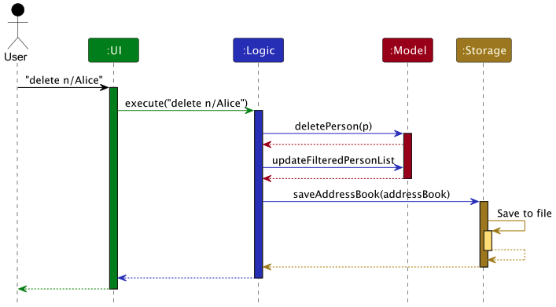
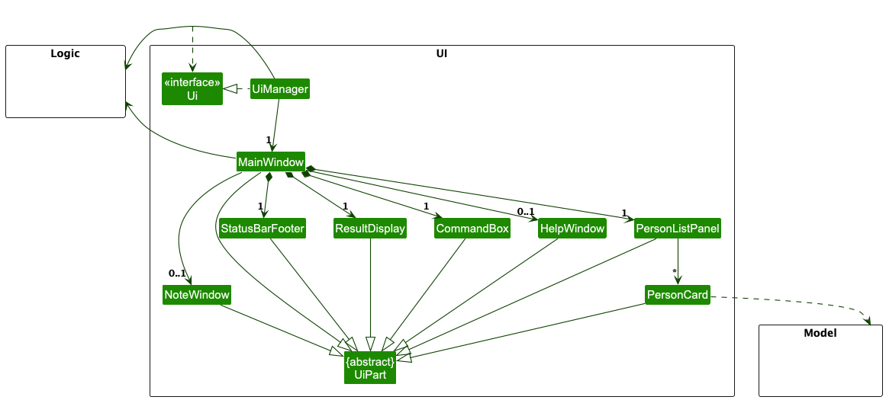
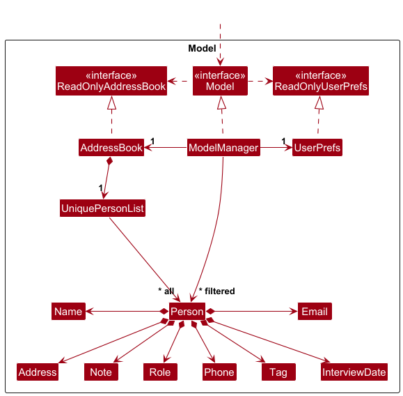
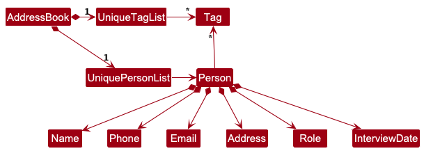

* Table of Contents
{:toc}

--------------------------------------------------------------------------------------------------------------------

## **Acknowledgements**

* This project is based on the AddressBook-Level3 project created by the [SE-EDU initiative](https://se-education.org).

--------------------------------------------------------------------------------------------------------------------

## **Setting up, getting started**

Refer to the guide [_Setting up and getting started_](SettingUp.md).

--------------------------------------------------------------------------------------------------------------------

## **Design**

:bulb: **Tip:** The `.puml` files used to create diagrams in this document `docs/diagrams` folder. Refer to the [_PlantUML Tutorial_ at se-edu/guides](https://se-education.org/guides/tutorials/plantUml.html) to learn how to create and edit diagrams.

### Architecture

The ***Architecture Diagram*** given above explains the high-level design of the App.

Given below is a quick overview of main components and how they interact with each other.

**Main components of the architecture**

**`Main`** (consisting of classes [`Main`](https://github.com/AY2425S2-CS2103T-F13-3/tp/blob/master/src/main/java/hirehive/address/Main.java) and [`MainApp`](https://github.com/AY2425S2-CS2103T-F13-3/tp/blob/master/src/main/java/hirehive/address/MainApp.java)) is in charge of the app launch and shut down.
* At app launch, it initializes the other components in the correct sequence, and connects them up with each other.
* At shut down, it shuts down the other components and invokes cleanup methods where necessary.

The bulk of the app's work is done by the following four components:

* [**`UI`**](#ui-component): The UI of the App.
* [**`Logic`**](#logic-component): The command executor.
* [**`Model`**](#model-component): Holds the data of the App in memory.
* [**`Storage`**](#storage-component): Reads data from, and writes data to, the hard disk.

[**`Commons`**](#common-classes) represents a collection of classes used by multiple other components.

**How the architecture components interact with each other**

The *Sequence Diagram* below shows how the components interact with each other for the scenario where the user issues the command `delete n/Alice`.

Each of the four main components (also shown in the diagram above),

* defines its *API* in an `interface` with the same name as the Component.
* implements its functionality using a concrete `{Component Name}Manager` class (which follows the corresponding API `interface` mentioned in the previous point.

For example, the `Logic` component defines its API in the `Logic.java` interface and implements its functionality using the `LogicManager.java` class which follows the `Logic` interface. Other components interact with a given component through its interface rather than the concrete class (reason: to prevent outside component's being coupled to the implementation of a component), as illustrated in the (partial) class diagram below.

The sections below give more details of each component.

### UI component

The **API** of this component is specified in [`Ui.java`](https://github.com/AY2425S2-CS2103T-F13-3/tp/blob/master/src/main/java/hirehive/address/ui/Ui.java)

The UI consists of a `MainWindow` that is made up of parts e.g.`CommandBox`, `ResultDisplay`, `PersonListPanel`, `StatusBarFooter` etc. All these, including the `MainWindow`, inherit from the abstract `UiPart` class which captures the commonalities between classes that represent parts of the visible GUI.

The `UI` component uses the JavaFx UI framework. The layout of these UI parts are defined in matching `.fxml` files that are in the `src/main/resources/view` folder. For example, the layout of the [`MainWindow`](https://github.com/AY2425S2-CS2103T-F13-3/tp/blob/master/src/main/java/hirehive/address/ui/MainWindow.java) is specified in [`MainWindow.fxml`](https://github.com/AY2425S2-CS2103T-F13-3/tp/blob/master/src/main/resources/view/MainWindow.fxml)

The `UI` component,

* executes user commands using the `Logic` component.
* listens for changes to `Model` data so that the UI can be updated with the modified data.
* keeps a reference to the `Logic` component, because the `UI` relies on the `Logic` to execute commands.
* depends on some classes in the `Model` component, as it displays `Person` object residing in the `Model`.

### Logic component

**API** : [`Logic.java`](https://github.com/AY2425S2-CS2103T-F13-3/tp/blob/master/src/main/java/hirehive/address/logic/Logic.java)

Here's a (partial) class diagram of the `Logic` component:

The sequence diagram below illustrates the interactions within the `Logic` component, taking `execute("delete n/Alice")` API call as an example.

:information_source: **Note:** The lifeline for `DeleteCommandParser` should end at the destroy marker (X) but due to a limitation of PlantUML, the lifeline continues till the end of diagram.

How the `Logic` component works:

1. When `Logic` is called upon to execute a command, it is passed to an `AddressBookParser` object which in turn creates a parser that matches the command (e.g., `DeleteCommandParser`) and uses it to parse the command.
1. This results in a `Command` object (more precisely, an object of one of its subclasses e.g., `DeleteCommand`) which is executed by the `LogicManager`.
1. The command can communicate with the `Model` when it is executed (e.g. to delete a person). 
   Note that although this is shown as a single step in the diagram above (for simplicity), in the code it can take several interactions (between the command object and the `Model`) to achieve.
1. The result of the command execution is encapsulated as a `CommandResult` object which is returned back from `Logic`.

Here are the other classes in `Logic` (omitted from the class diagram above) that are used for parsing a user command:

How the parsing works:
* When called upon to parse a user command, the `AddressBookParser` class creates an `XYZCommandParser` (`XYZ` is a placeholder for the specific command name e.g., `AddCommandParser`) which uses the other classes shown above to parse the user command and create a `XYZCommand` object (e.g., `AddCommand`) which the `AddressBookParser` returns back as a `Command` object.
* All `XYZCommandParser` classes (e.g., `AddCommandParser`, `DeleteCommandParser`, ...) inherit from the `Parser` interface so that they can be treated similarly where possible e.g, during testing.

### Model component
**API** : [`Model.java`](https://github.com/AY2425S2-CS2103T-F13-3/tp/blob/master/src/main/java/hirehive/address/model/Model.java)

The `Model` component,

* stores the address book data i.e., all `Person` objects (which are contained in a `UniquePersonList` object).
* stores the currently 'selected' `Person` objects (e.g., results of a search query) as a separate _filtered_ list which is exposed to outsiders as an unmodifiable `ObservableList<Person>` that can be 'observed' e.g. the UI can be bound to this list so that the UI automatically updates when the data in the list change.
* stores a `UserPref` object that represents the user’s preferences. This is exposed to the outside as a `ReadOnlyUserPref` objects.
* does not depend on any of the other three components (as the `Model` represents data entities of the domain, they should make sense on their own without depending on other components)

:information_source: **Note:** An alternative (arguably, a more OOP) model is given below. It has a `Tag` list in the `AddressBook`, which `Person` references. This allows `AddressBook` to only require one `Tag` object per unique tag, instead of each `Person` needing their own `Tag` objects. 

### Storage component

**API** : [`Storage.java`](https://github.com/AY2425S2-CS2103T-F13-3/tp/blob/master/src/main/java/hirehive/address/storage/Storage.java)

The `Storage` component,
* can save both address book data and user preference data in JSON format, and read them back into corresponding objects.
* inherits from both `AddressBookStorage` and `UserPrefStorage`, which means it can be treated as either one (if only the functionality of only one is needed).
* depends on some classes in the `Model` component (because the `Storage` component's job is to save/retrieve objects that belong to the `Model`)

### Common classes

Classes used by multiple components are in the `seedu.address.commons` package.

--------------------------------------------------------------------------------------------------------------------

## **Implementation**

This section describes some noteworthy details on how certain features are implemented.

### \[Proposed\] Undo/redo feature

#### Proposed Implementation

The proposed undo/redo mechanism is facilitated by `VersionedAddressBook`. It extends `AddressBook` with an undo/redo history, stored internally as an `addressBookStateList` and `currentStatePointer`. Additionally, it implements the following operations:

* `VersionedAddressBook#commit()` — Saves the current address book state in its history.
* `VersionedAddressBook#undo()` — Restores the previous address book state from its history.
* `VersionedAddressBook#redo()` — Restores a previously undone address book state from its history.

These operations are exposed in the `Model` interface as `Model#commitAddressBook()`, `Model#undoAddressBook()` and `Model#redoAddressBook()` respectively.

Given below is an example usage scenario and how the undo/redo mechanism behaves at each step.

Step 1. The user launches the application for the first time. The `VersionedAddressBook` will be initialized with the initial address book state, and the `currentStatePointer` pointing to that single address book state.

Step 2. The user executes `delete 5` command to delete the 5th person in the address book. The `delete` command calls `Model#commitAddressBook()`, causing the modified state of the address book after the `delete 5` command executes to be saved in the `addressBookStateList`, and the `currentStatePointer` is shifted to the newly inserted address book state.

Step 3. The user executes `add n/David …​` to add a new person. The `add` command also calls `Model#commitAddressBook()`, causing another modified address book state to be saved into the `addressBookStateList`.

:information_source: **Note:** If a command fails its execution, it will not call `Model#commitAddressBook()`, so the address book state will not be saved into the `addressBookStateList`.

Step 4. The user now decides that adding the person was a mistake, and decides to undo that action by executing the `undo` command. The `undo` command will call `Model#undoAddressBook()`, which will shift the `currentStatePointer` once to the left, pointing it to the previous address book state, and restores the address book to that state.

:information_source: **Note:** If the `currentStatePointer` is at index 0, pointing to the initial AddressBook state, then there are no previous AddressBook states to restore. The `undo` command uses `Model#canUndoAddressBook()` to check if this is the case. If so, it will return an error to the user rather
than attempting to perform the undo.

The following sequence diagram shows how an undo operation goes through the `Logic` component:

:information_source: **Note:** The lifeline for `UndoCommand` should end at the destroy marker (X) but due to a limitation of PlantUML, the lifeline reaches the end of diagram.

Similarly, how an undo operation goes through the `Model` component is shown below:

The `redo` command does the opposite — it calls `Model#redoAddressBook()`, which shifts the `currentStatePointer` once to the right, pointing to the previously undone state, and restores the address book to that state.

:information_source: **Note:** If the `currentStatePointer` is at index `addressBookStateList.size() - 1`, pointing to the latest address book state, then there are no undone AddressBook states to restore. The `redo` command uses `Model#canRedoAddressBook()` to check if this is the case. If so, it will return an error to the user rather than attempting to perform the redo.

Step 5. The user then decides to execute the command `list`. Commands that do not modify the address book, such as `list`, will usually not call `Model#commitAddressBook()`, `Model#undoAddressBook()` or `Model#redoAddressBook()`. Thus, the `addressBookStateList` remains unchanged.

Step 6. The user executes `clear`, which calls `Model#commitAddressBook()`. Since the `currentStatePointer` is not pointing at the end of the `addressBookStateList`, all address book states after the `currentStatePointer` will be purged. Reason: It no longer makes sense to redo the `add n/David …​` command. This is the behavior that most modern desktop applications follow.

The following activity diagram summarizes what happens when a user executes a new command:

#### Design considerations:

**Aspect: How undo & redo executes:**

* **Alternative 1 (current choice):** Saves the entire address book.
  * Pros: Easy to implement.
  * Cons: May have performance issues in terms of memory usage.

* **Alternative 2:** Individual command knows how to undo/redo by
  itself.
  * Pros: Will use less memory (e.g. for `delete`, just save the person being deleted).
  * Cons: We must ensure that the implementation of each individual command are correct.

_{more aspects and alternatives to be added}_

### \[Proposed\] Data archiving

_{Explain here how the data archiving feature will be implemented}_

--------------------------------------------------------------------------------------------------------------------

## **Documentation, logging, testing, configuration, dev-ops**

* [Documentation guide](Documentation.md)
* [Testing guide](Testing.md)
* [Logging guide](Logging.md)
* [Configuration guide](Configuration.md)
* [DevOps guide](DevOps.md)

--------------------------------------------------------------------------------------------------------------------

## **Appendix: Requirements**

### Product scope

**Target user**: HR and recruitment manager for a small company

**User profile**:

* has a need to manage a significant number of contacts
* prefer desktop apps over other types
* can type fast
* prefers typing to mouse interactions
* is reasonably comfortable using CLI apps

**Value proposition**: help the HR manager to effortlessly manage job candidates, interview notes, recruitment status and past communications in one place at a glance, simplifying recruitment with an intuitive, organized, and scalable solution.

### User stories

Priorities: High (must have) - `* * *`, Medium (nice to have) - `* *`, Low (unlikely to have) - `*`

| Priority | As a …​    | I want to …​                 | So that I can…​                                                     |
|--------|------------|------------------------------|---------------------------------------------------------------------|
| `* * *` | HR manager | look at the information of the interviewees       | so that I can review their qualifications for the role              |
| `* * *` | HR manager | be able to add a new applicant’s information and contact details             | I can keep track of potential candidates.                           |
| `* * *` | HR manager | delete the information of an applicant              | I know which applicants do not qualify for an interview.            |
| `* * *` | HR manager | be able to tag candidates with custom labels such as “Shortlisted” or “Rejected”      | I can send out information more easily.                             |
| `* * *` | HR manager | be able to tag applicants based on their stages of application (into applicants/candidates/interviewees) | I know their progress in the interviews.                            |
| `* * *` | HR manager | save my candidate's information into my local storage         | I can access it again in the future                                 |
| `* *`  | HR manager | be able to sort the interviewees based on the date of their interview       | it is more convenient for me to keep track of who I am interviewing |
| `* *`  | HR manager | be able to add interview notes to an interviewee profile        | I can keep track of my opinions of them                             |
| `* *`  | HR manager | be able to search for an interviewee’s name        | I can quickly find their contact details                            |
| `* *`  | HR manager | be able to see a list of all potential applicants        | I can get an overview of how many candidates are applying           |
| `* *`  | HR manager | sort candidates by their custom labels/tags       | I can group them together and send them the correct information.    |
| `* *`  | HR manager | receive reminders for upcoming interviews     | I never miss a scheduled interview                                  |
| `*`    | HR manager | attach resumes and cover letters to each applicant’s profile     | I can quickly review their qualifications.                          |
| `*`    | HR manager | be able to automatically schedule interviews on applicants’ available timings   | I am less likely to make mistakes during arrangement                |
| `*` | HR manager | filter the applicants based on certain characteristics | I can efficiently decide who qualifies for an interview             |
| `* *` | HR manager | be able to see the count of applicants by the respective stages of application | I can fill the job vacancies adequately. |

### Use cases

(For all use cases below, the **System** is the `HireHive` and the **Actor** is the `user`, unless specified otherwise)

**Use case: UC01: - Add a person**

**MSS**

1. User requests to add a person
2. HireHive displays the added person
3. HireHive adds the person

    Use case ends.

**Extensions**
* 1a. The user input is invalid
  * 1a1. HireHive shows an error message

    Use case restarts from step 1.

**Use case: UC02 - List all persons**

**MSS**
1. User requests to list persons
2. HireHive shows a list of persons

    Use case ends.

**Extensions**
* 1a. The list is empty
    * 1a1. HireHive shows an error message

        Use case ends.

**Use case: UC03 - Delete a person**

**MSS**

1.  User requests to <ins>list persons (UC02)</ins>.
2. User requests to delete a specific person in the list
3. HireHive deletes the person

    Use case ends.

**Extensions**

* 3a. The given index is invalid.

    * 3a1. HireHive shows an error message.

      Use case resumes at step 1.

**Use case: UC04 - Tag a person**

**MSS**

1. User requests to <ins>list persons (UC02)</ins>.
2. User requests to tag a person with a number of tags.
3. HireHive tags the person with the tags
    Use case ends.

**Extensions**

* 3a. The given index is invalid.

    * 3a1. HireHive shows an error message.

      Use case resumes at step 1.

*{More to be added}*

### Non-Functional Requirements

1.  Should work on any _mainstream OS_ as long as it has Java `17` or above installed.
2.  Should be able to hold up to 1000 persons without a noticeable sluggishness in performance for typical usage.
3.  A user with above average typing speed for regular English text (i.e. not code, not system admin commands) should be able to accomplish most of the tasks faster using commands than using the mouse.
4. Operations by the system should return responses in under 2 seconds.
5. Data should be backed up or stored in alternative formats, in the event that the default format which the data is loaded from becomes corrupted.
6. Data must be saved immediately upon change to ensure data persistence.

### Glossary

* **Mainstream OS**: Windows, Linux, Unix, MacOS
* **Private contact detail**: A contact detail that is not meant to be shared with others
* **Applicants**: Anyone who submits an application to the company
* **Candidates**: Applicants who are potentially qualified for the job
* **Interviewees**: Candidates that accept an interview offer
* **Offered**: Interviewees that receive job offers
* **Rejected**: Interviewees that did not receive job offers

--------------------------------------------------------------------------------------------------------------------

## **Appendix: Instructions for manual testing**

Given below are instructions to test the app manually.

:information_source: **Note:** These instructions only provide a starting point for testers to work on;
testers are expected to do more *exploratory* testing.

### Launch and shutdown

1. Initial launch

   1. Download the jar file and copy into an empty folder

   1. Double-click the jar file Expected: Shows the GUI with a set of sample contacts. The window size may not be optimum.

1. Saving window preferences

   1. Resize the window to an optimum size. Move the window to a different location. Close the window.

   1. Re-launch the app by double-clicking the jar file. 
       Expected: The most recent window size and location is retained.

### Viewing help
1. Viewing help page

   1. Prerequisites: Application must be running.
   
   2. Test case: `help`  
      Expected: A 'Help' window pops up, with the link to the user guide, that can be copied.
   
   3. Test case: `help 1`  
      Expected: A 'Help' window pops up, with the link to the user guide, that can be copied.

### Adding a person
1. Adding a person

   1. Prerequisites: Application must be running.
   
   2. Test case: `add n/Betsy Crowe e/betsycrowe@example.com a/Ang Mo Kio Street 22 p/87654321 r/senior consulting analyst`  
       Expected: A person with name "Betsy Crowe", email "betsycrowe@example.com", address "Ang Mo Kio Street 22", phone number "87654321", applying for the "senior consulting analyst" role is added to the bottom of the existing list. Added person is given an index that follows immediately after the last assigned index.

   3. Test case: `add n/John Doe a/Bishan Street 20 p/98765432 r/senior consulting intern`  
      Expected: No person is added. Error details shown in the status message.
   
   4. Test case: `add n/John Doe e/john@gmail.com a/Bishan Street 20 p/98765432 r/senior consulting intern t/applicant`  
      Expected: No person is added. Error details shown in the status message.
   
   5. Test case: `add n/John Doe e/john@gmail.com a/Bishan Street 20 p/98765432 r/senior consulting intern i/Likes to talk`  
      Expected: No person is added. Error details shown in the status message.
   
   6. Test case: `add n/小丽 e/john@gmail.com a/Bishan Street 20 p/98765432 r/senior consulting intern`  
      Expected: No person is added. Error details shown in the status message.

### Listing persons
1. Listing all the persons in HireHive

   1. Prerequisites: List is not empty
   
   2. Test case: `list`  
      Expected: All the persons in the list are listed. Topmost person in the list is the oldest person who was added to the list, while the bottom-most person was the person who was most recently added to the list. Index of persons should start from 1 and increase from top to bottom of the list. 
   3. Test case: `list help`   
       Expected: All the persons in the list are listed. Topmost person in the list is the oldest person who was added to the list, while the bottom-most person was the person who was most recently added to the list. Index of persons should start from 1 and increase from top to bottom of the list.

### Sorting persons
1. Sorting all the persons shown in the list. 

   1. Prerequisites: Multiple persons in the list, with some persons having interview dates
   
   2. Test case: `sort`  
      Expected: All the persons in the list are sorted.Those with interview dates are sorted in chronological order, while those without interview dates are pushed to the back of the list, in the original order they were in previously. New index given based on the newly sorted order of the list.

   3. Test case: `list help`  
      Expected: All the persons in the list are sorted.Those with interview dates are sorted in chronological order, while those without interview dates are pushed to the back of the list, in the original order they were in previously. New index given based on the newly sorted order of the list.

### Deleting a person

1. Deleting a person by index

   1. Prerequisites: List all persons using the `list` command. Multiple persons in the list.
   
   2. Test case: `delete 1` 
      Expected: First contact is deleted from the list. Details of the deleted contact shown in the status message. 

   3. Test case: `delete 0` 
      Expected: No person is deleted. Error details shown in the status message. Status bar remains the same.

   4. Other incorrect delete commands to try: `delete`, `delete x`, `...` (where x is larger than the list size) 
      Expected: Similar to previous.

1. Deleting a person by name
   1. Prerequisites: List all persons using `list` command. Multiple persons in the list 

   2. Test case: `delete n/Alice`  
      Expected: Contact with the name "Alice" is deleted from the list. Details of the deleted contact shown in status message. 
   3. Test case: `delete n/john doe`  
      Expected: Contact with the name "John Doe" is deleted from the list. Details of the deleted contact shown in status message.
   4. Test case: `delete n/nonexistent name`  
      Expected: Error message is shown, stating that no such contact exists in the list
   5. Test case: `delete john`  
      Expected: Error message for invalid command format is displayed in status message with example.

### Tagging a person

1. Tagging a person by name, with tag
   1. Prerequisites: Use the same persons list as when you first ran HireHive.jar
   2. Test case: `tag n/alice t/candidate`  
      Expected: Contact with name "Alice Yeoh" is tagged as "Candidate". Details of the tagged contact shown in the 
      status message.
   3. Test case: `tag n/alice t/CANDIDATE`  
      Expected: Contact with name "Alice Yeoh" is tagged as "Candidate". Details of the tagged contact shown in the
      status message.
   4. Test case: `tag n/alice t/cAnDiDaTe`  
      Expected: Contact with name "Alice Yeoh" is tagged as "Candidate". Details of the tagged contact shown in the
      status message.
   5. Test case: `tag n/ALICE t/candidate`  
      Expected: Contact with name "Alice Yeoh" is tagged as "Candidate". Details of the tagged contact shown in the
      status message.
   6. Test case: `tag n/aLiCe t/CANDIDATE`  
      Expected: Contact with name "Alice Yeoh" is tagged as "Candidate". Details of the tagged contact shown in the
      status message.
   7. Test case: `tag n/alice t/test`  
      Expected: Error message for invalid command format shown in status message with command format and example.
2. Tagging a person by index, with tag
   1. Prerequisites: Use the same persons list as when you first ran HireHive.jar
   2. Test case: `tag 1 t/interviewee`  
      Expected: First contact is tagged as "Interviewee". Details of the tagged contact shown in the
      status message.
   3. Test case: `tag 1 t/INTERVIEWEE`  
      Expected: First contact is tagged as "Interviewee". Details of the tagged contact shown in the
      status message. 
   4. Test case: `tag 1 t/iNtErViEwEe`  
      Expected: First contact is tagged as "Interviewee". Details of the tagged contact shown in the
      status message.
   5. Test case: `tag 1 t/test`  
      Expected: Error message for invalid command format shown in status message with command format and example.
3. Tagging a person by name, with offset
   1. Prerequisites: Use the same persons list as when you first ran HireHive.jar
   2. Test case: `tag +1 n/bernice`  
      Expected: Contact with name "Bernice Yu" is tagged as "Offered". Details of the tagged contact shown 
      in the status message (if tag was "Interviewee"). 
   3. Test case `tag -2 n/charlotte`  
      Expected: Contact with name "Charlotte Oliveiro" is tagged as "Rejected". Details of the tagged contact shown
      in the status message (if tag was "Candidate"). 

### Show persons with upcoming interviews

1. Show persons with upcoming interviews
   1. Prerequisites: Use the same persons list as when you first ran HireHive.jar
   2. Test case: `remind 100`  
      Expected: Only the contact with name "David Li" and interview date "06/07/2025" is shown in the list. Success 
      message shown in the status message.
   3. Test case: `remind -1`  
      Expected: Error message for invalid command format shown in status message with command format and example.

### Scheduling interview date

1. Scheduling an interview date for a person by name
   1. Prerequisites: Use the same persons list as when you first ran HireHive.jar
   2. Test case: `schedule n/alice d/04/05/2025`  
      Expected: Contact with name "Alice Yeoh" has interview date scheduled as "04/05/2025". Details of the scheduled 
      contact shown in the status message.
   3. Test case: `schedule n/alice d/test`  
      Expected: Error message for invalid command format shown in status message with command format and example.
2. Scheduling an interview date for a person by index
   1. Prerequisites: Use the same persons list as when you first ran HireHive.jar
   2. Test case: `schedule 1 d/04/05/2025`  
      Expected: First contact has interview date scheduled as "04/05/2025". Details of the scheduled
      contact shown in the status message.
   3. Test case: `schedule 1 d/test`  
      Expected: Expected: Error message for invalid command format shown in status message with command format and example.
3. Automatically scheduling the next interview date
   1. Prerequisites: Use the same persons list as when you first ran HireHive.jar
   2. Test case: `schedule 1` 
      Expected: First contact will be updated to tomorrow's date.
   3. Test case: `schedule n/alice`  
      Expected: Alice's contact will be updated to tomorrow's date

### Filtering out applicants with tag
1. Filtering out all applicants with specified tag, and the remaining list contains applicants without that tag
   1. Prerequisities: Use the same persons list as when you first ran HireHive.jar
   2. Test case: `filterout t/interviewee`  
      Expected: All contacts without the interviewee tag will be displayed on the list
   3. Test case: `filterout t/Applicant`  
      Expected: All contacts without the Applicant tag will be displayed on the list
   4. Test case: `filterout t/testing`  
      Expected: Error message for invalid command format shown in status message with command format and example.
   5. Test case `filterout candidate`  
      Expected: Error message for invalid command format shown in status message with command format and example.

### Clearing all entries
1. Clearing all entries in HireHive

    1. Prerequisites: List contains people.

    2. Test case: `clear`  
       Expected: All the persons in the list are cleared. List is now empty.

    3. Test case: `Clear`  
       Expected: Nothing is cleared. Error details shown in the status message.

### Exiting the program 
1. Exiting the program

   1. Prerequisites: Program was originally running.
   
   2. Test case: `exit`  
      Expected: Program exits and closes. 

### Adding note of a person

Prerequisite: use the initial persons list loaded when first running HireHive.jar
1. Test case: `newnote n/Bernice Yu i/20 years old`   Expected output: "Added and displaying note of: Bernice Yu; Phone: 99272758; Email: berniceyu@example.com; Address: Blk 30 Lorong 3 Serangoon Gardens, #07-18; Role: HR manager; Date: 01/03/2025; Tag: INTERVIEWEE   Success: Applicant data has been saved." Additionally, popup window shows "20 years old" in white font.
2. Test case: `newnote n/BeRnIcE i/19 years old`   Expected output: same as test case 1, but popup window shows "19 years old" in white font.
3. Test case: `newnote n/  Bernice  i/18 years old`   Expected output: same as test case 1, but popup window shows "18 years old" in white font.
4. Test case: `newnote n/Yu i/`   Expected output: same as test case 1, but popup window shows "Currently empty..." in yellow font.
5. Test case: `newnote n/bErNiCe yU i/Currently empty...`   Expected output: same as test case 1, but popup window shows "Currently empty..." in white font.

### Displaying note of a person

Prerequisite: use the initial persons list loaded when first running HireHive.jar
1. Test case: `displaynote n/Alice Yeoh`   Expected output: "Displaying note of: Alice Yeoh; Phone: 87438807; Email: alexyeoh@example.com; Address: Blk 30 Geylang Street 29, #06-40; Role: UI designer; Date: ; Tag: APPLICANT" Additionally, popup window shows "20 years old" in white font.
2. Test case: `displaynote n/BeRnIcE yU`   Expected output: "Displaying note of: Bernice Yu; Phone: 99272758; Email: berniceyu@example.com; Address: Blk 30 Lorong 3 Serangoon Gardens, #07-18; Role: HR manager; Date: 01/03/2025; Tag: INTERVIEWEE" Additionally, popup window shows "Currently empty..." in yellow font.
3. Test case: `displaynote n/Irfan`   Expected output: "Displaying note of: Irfan Ibrahim; Phone: 92492021; Email: irfan@example.com; Address: Blk 47 Tampines Street 20, #17-35; Role: Software Engineer; Date: 06/03/2025; Tag: REJECTED" Additionally, popup window shows "30 years old" in white font.
4. Test case: `newnote n/raHIM i/`   Expected output: same as test case 3.

### Loading data

1. Sample data is loaded
   1. Test case: On first launch of `HireHive.jar`, this should automatically load the sample data.   Expected output: "Success: Sample applicant data has been loaded successfully."
   2. Test case: Delete `addressbook.json` under folder `data` if it exists, then launch `HireHive.jar`.   Expected output: same as test case i.

2. Saved data is loaded
   1. Test case: perform a command that modifies data e.g. `delete 1`, then `exit` the application. Relaunch `HireHive.jar`.   Expected output: "Success: Applicant data has been loaded successfully."

3. No data is loaded due to corruption of data
   1. Prerequisite: Launch `HireHive.jar` at least once and exit.
   2. Test case: Delete `addressbook.json` under folder `data` if it exists, then copy `config.json` into the same folder. Rename `config.json` to `addressbook.json`.   Expected output: "Error: Unable to load applicant data. Invalid data format in saved file."
