# Welcome to HireHive!

Tired of drowning in resumes and losing track of candidates? Meet HireHive— your **personal, all-in-one** hiring assistant designed to simplify the hiring process so you can focus on what matters most - finding the best talent.

We combine the speed of keyboard commands with an intuitive visual interface to help you:
- Find top talent faster with **lightning-fast** keyboard shortcuts
- Stay effortlessly organized with all **[applicant](#glossary) details in one place**
- Make better hiring decisions with **structured interview notes**

Ready to revolutionise your hiring? Let's begin!

- [Quick start](#quick-start)
- [Command Summary](#command-summary)
- [Features](#features)
    - [View help: `help`](#view-help-help)
    - [Adding and modifying applicants](#adding-and-modifying-applicants)
      - [Add an applicant: `add`](#add-an-applicant-add)
      - [Edit an applicant: `edit`](#edit-an-applicant-edit)
      - [Tag an applicant: `tag`](#tag-an-applicant-tag)
      - [Add note to applicant: `newnote`](#add-note-to-applicant-newnote)
      - [Schedule interview dates: `schedule`](#schedule-interview-dates-for-applicants--schedule)
    - [Listing applicant information](#listing-applicant-information)
      - [Display note of applicant: `displaynote`](#display-note-of-applicant-displaynote)
      - [Sort applicants `sort`](#sort-applicants-sort)
      - [List all applicants: `list`](#list-all-applicants-list)
    - [Filtering applicant information](#filtering-applicant-information)
      - [Filter applicants by tag: `filter`](#filter-applicants-by-tag-filter)
      - [Filtering out applicants with tag: `filterout`](#filtering-out-applicants-with-tag-filterout)
      - [Remind you of upcoming interviews: `remind`](#show-applicants-with-upcoming-interviews-remind)
      - [Find applicants by name `find`](#find-applicants-by-name-find)
    - [Deletion of applicants](#deletion-of-applicants)
      - [Delete an applicant: `delete`](#delete-an-applicant-delete)
      - [Clear all entries: `clear`](#clear-all-entries--clear)
    - [Exit the program: `exit`](#exit-the-program--exit)
    - [Save the data](#save-the-data)
    - [Edit the data file](#edit-the-data-file)
- [FAQ](#faq)
- [Known Issues](#known-issues)
- [Glossary](#glossary)

--------------------------------------------------------------------------------------------------------------------

## Quick start
1. To use Hirehive, you need Java `17` or above installed in your computer. 
   - For **Mac users:** Ensure you have the precise version prescribed [here](https://se-education.org/guides/tutorials/javaInstallationMac.html).

2. Download the latest HireHive `.jar` file from [here](https://github.com/AY2425S2-CS2103T-F13-3/tp/releases).

3. Copy the downloaded file to a folder where you would like to store HireHive (e.g. "Documents" or "Desktop" or a new folder "HireHive") .

4. Run HireHive.
   - Find the folder that you stored HireHive previously (e.g. "Documents" or "Desktop" or "HireHive").
   - Right-click on the folder and choose:
     - For **Mac users**: "New terminal at Folder".
     - For **Windows users**: "Open in terminal".
   - Type `java -jar hirehive.jar` command in the opened terminal and press Enter to run the HireHive application. 
   - A [GUI](#glossary) similar to the below should appear in a few seconds. Note how the app contains some sample data. 
   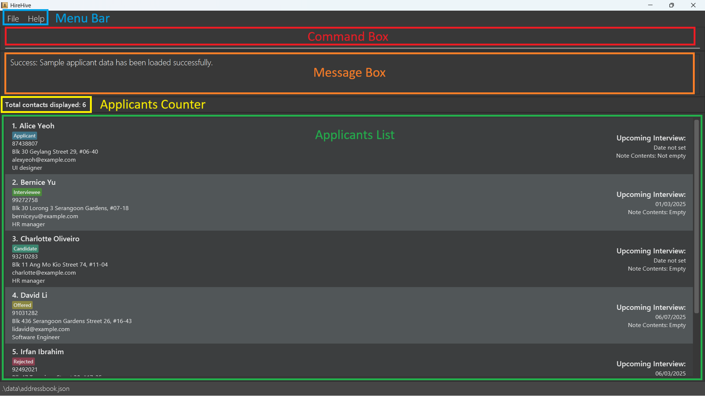

5. To use HireHive, you can type a command in the command box and press Enter to execute it. e.g. typing `help` and pressing Enter will open the help window. 
   Some example commands you can try:

   * `list` : Lists all applicants.

   * `add n/John Doe p/98765432 e/johnd@example.com a/John street, block 123, #01-01 r/intern`: Adds an applicant named `John Doe` to HireHive, with his relevant information

   * `edit 3 n/Josef` : Edits the name of the 3rd applicant in the list to Josef

   * `find John Doe`: Searches for John Doe in the current list.

   * `tag n/John Doe t/interviewee` : Tags John Doe with the 'interviewee' tag
   
   * `delete n/John Doe` : Deletes the applicant `John Doe` from the current list.

   * `exit` : Exits the app.

    

    
    **:information_source: Note:** 
    Note that in HireHive, every applicant should **contain a [unique](#glossary) name**!
    

6. You can refer to the [Features](#features) section below for details of each command.

[Back to top](#welcome-to-hirehive)

--------------------------------------------------------------------------------------------------------------------

## Command summary

| Action                                                            | Format, Examples                                                                                                                                                        |
|-------------------------------------------------------------------|-------------------------------------------------------------------------------------------------------------------------------------------------------------------------|
| **[Help](#view-help-help)**                                       | `help`                                                                                                                                                                  |
| **[Add](#add-an-applicant-add)**                                  | `add n/NAME p/PHONE_NUMBER e/EMAIL a/ADDRESS r/ROLE`   e.g. `add n/James Ho p/87654321 e/jamesho@example.com a/123, Clementi Rd, 1234665 r/software engineer intern` |
| **[Edit](#edit-an-applicant-edit)**                               | `edit INDEX [n/NAME] [p/PHONE_NUMBER] [e/EMAIL] [a/ADDRESS] [t/TAG] [i/NOTE] [d/DATE]`  e.g. `edit 2 n/James Lee e/jameslee@example.com`                             |
| **[Tag](#tag-an-applicant-tag)**                                  | `tag n/NAME t/TAG`   e.g. `tag n/John Doe t/Applicant`  `tag INDEX t/TAG`   e.g. `tag 1 t/Candidate`   `tag OFFSET n/NAME`   e.g. `tag +1 n/John Doe`                       |
| **[NewNote](#add-notes-to-applicant-newnote)**                    | `newnote n/NAME i/NOTE`   e.g. `newnote n/John Doe i/25 years old`                                                                                                   |
| **[Schedule](#schedule-interview-dates-for-applicants--schedule)** | 1. `schedule n/NAME [id/DATE]`   e.g. `schedule n/John Doe d/17/04/2025`   2. `schedule INDEX [id/DATE]`   e.g. `schedule 2 d/17/04/2025`                   |
| **[DisplayNote](#display-note-of-applicant-displaynote)**         | `displaynote n/NAME`   e.g. `displaynote n/John Doe`                                                                                                                 |
| **[Sort](#sort-applicants-sort)**                                 | `sort`                                                                                                                                                                  |
| **[List](#list-all-applicants-list)**                             | `list`                                                                                                                                                                  |
| **[Filter](#filter-applicants-by-tag-filter)**                    | `filter t/TAG`   e.g. `filter t/Applicant`                                                                                                                           |
| **[FilterOut](#filtering-out-applicants-with-tag-filterout)**     | `filterout t/TAG`   e.g. `filterout t/Applicant`                                                                                                                     |
| **[Reminder](#show-applicants-with-upcoming-interviews-remind)**  | `remind DAYS`    e.g. `remind 3`                                                                                                                                     |
| **[Find](#find-applicants-by-name-find)**                         | `find KEYWORD [MORE_KEYWORDS]`  e.g. `find James Jake`                                                                                                               |
| **[Delete](#delete-an-applicant-delete)**                         | 1. `delete n/NAME`  e.g. `delete n/John Doe`   2. `delete INDEX`   e.g. `delete 2`                                                                             |
| **[Clear](#clear-all-entries--clear)**                            | `clear`                                                                                                                                                                 |
| **[Exit](#exit-the-program--exit)**                               | `exit`                                                                                                                                                                  |

[Back to top](#welcome-to-hirehive)

--------------------------------------------------------------------------------------------------------------------

## Features

**:information_source: Notes about the command format:** 

* Words in `UPPER_CASE` are the  parameters to be supplied by you. 
  e.g. in `add n/NAME`, `NAME` is a parameter which can be used as `add n/John Doe`.

* Items in square brackets are optional. 
  e.g `n/NAME [i/NOTE]` can be used as `n/John Doe i/27 years old` or as `n/John Doe`.

* Items with `…`​ after them can be used multiple times including zero times. 
  e.g. `[t/TAG]…​` can be used as ` ` (i.e. 0 times), `t/interviewee`, `t/shortlisted` etc.

* Parameters can be in any order. 
  e.g. if the command specifies `n/NAME p/PHONE_NUMBER`, `p/PHONE_NUMBER n/NAME` is also acceptable.

* Extraneous parameters for commands that do not take in parameters (such as `help`, `list`, `exit`, `list` and `clear`) will be ignored. 
  e.g. if the command specifies `help 123`, it will be interpreted as `help`.

[Back to top](#welcome-to-hirehive)

### View help: `help`

Shows a message explaining how you can access the help page that can assist you in understanding the different features of HireHive and how they work.

Format: `help`

[Back to top](#welcome-to-hirehive)

### <u>Adding and modifying applicants</u>

### Add an applicant: `add`

You can add a new applicant to HireHive when someone new applies to your company!

Format: `add n/NAME p/PHONE_NUMBER e/EMAIL a/ADDRESS r/ROLE`

* NAME: 
  - Names should only contain **English letters**, **spaces**, and the following symbols: **, ( ) / . @ - '**
    - Example: `Ali s/o Mohammed`, `Rachel-Natalie`, `Si Min, Rachel O' Connor` are allowed names. 
  - Names **should not be blank or start with a symbol**. 
    - Example: `@Natalie` is not allowed
  - Please **do not use numbers** in names.
    - Example: `R4chel` is not allowed
  - Names are **[case-insensitive](#glossary)**, and is displayed as how you type it.

* PHONE_NUMBER: 
  - Please input a phone number that **start with 9/8/6** and is **exactly 8 digits** long.
  - Please **do not use spaces** 
  
* EMAIL:
  - Emails should be of the format **local-part@domain** and adhere to the following constraints:
    1. local-part: 
       - The local-part should only contain **[alphanumeric](#glossary) characters** and the special characters: **+_.-**
       - The local-part **should not start or end with any special characters**.
    2. domain:
       - The domain name is made up of domain labels that may or may not be separated by periods. 
       - The domain name must:
           - end with a domain label **at least 2 characters** long, and
           - have each domain label **start and end with [alphanumeric](#glossary) characters**, and
           - have each domain label consist of [alphanumeric](#glossary) characters, separated only by hyphens, if any.

* ADDRESS: 
  - Addresses can take any values, and it should not be blank

* ROLE: 
  - Roles should only **contain [alphanumeric](#glossary) characters and spaces**, and it should not be blank. 

**:information_source: Note:**  
Every applicant in HireHive should **contain a [unique](#glossary) name**!
  - i.e. HireHive ensures that there are no applicants in HireHive that have the same name!
  - More specifically, applicants can share the same phone number, email, address and role, but **not name**!
    - Example: `add n/John Doe p/98765432 e/johnd@example.com a/311, Clementi Ave 2, #02-25 r/Software Engineer` and 
      `add n/John Wee p/98765432 e/johnd@example.com a/311, Clementi Ave 2, #02-25 r/Software Engineer` are treated as 2 different applicants and both applicants can be added!

:bulb: **Tip:**
There is no need to manually add a tag as the 'Applicant' tag is automatically assigned when you add a new applicant to HireHive.

Examples:
* `add n/Betsy Crowe e/betsycrowe@example.com a/Ang Mo Kio Street 22 p/87654321 r/senior consulting analyst`: Adds an applicant with the name `Betsy Crowe`, who has `betsycrowe@example.com` as their email, `87654321` as their phone number, and is applying for the `senior consulting analyst` role.

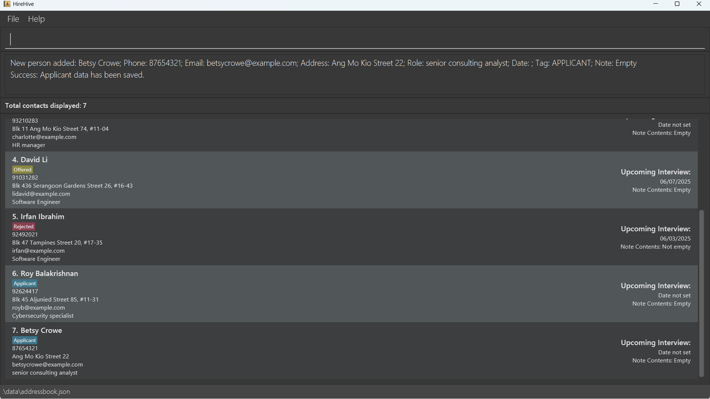

[Back to top](#welcome-to-hirehive)

### Edit an applicant: `edit`

If you have accidentally mistyped some details, you can edit the information of an existing applicant in HireHive!

Format: `edit INDEX [n/NAME] [p/PHONE] [e/EMAIL] [a/ADDRESS] [t/TAG] [r/ROLE] [i/NOTE] [id/DATE]`

* Edits the applicant at the specified `INDEX`. The index refers to the index number shown in the displayed applicant list. The index **must be a positive integer** 1, 2, 3, …​
* At least one of the optional fields must be provided.
* The provided values will replace the existing information in the respective fields.

**:information_source: Note:** 
* All the fields provided should follow the same rules as the [Add command](#add-an-applicant-add)
* Every applicant should have a **[unique](#glossary)** name

Examples:
*  `edit 1 p/91234567 e/johndoe@example.com` Edits the phone number and email address of the 1st applicant to be `91234567` and `johndoe@example.com` respectively.

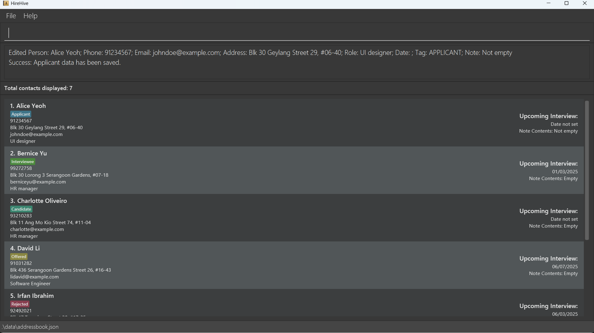

[Back to top](#welcome-to-hirehive)

### Tag an applicant: `tag`

You can change the tag to a specific applicant from HireHive to easily differentiate between all your applicants!

Format:

Command | Description
--------|------------------
`tag n/NAME t/TAG` | Tags by name.
`tag INDEX t/TAG` | Tags by index.
`tag OFFSET n/NAME` | Offset tag of named applicant.

* Tagging by name will partially match to **exactly one applicant** in the list ([case-insensitive](#glossary)).
  * If multiple matches are found, a list of all matching names will be displayed. You can then enter the **full name**
    of the applicant you want to tag.
* Tagging by index must have a **positive** index number
* Tags must be one of the following values, which are colour-coded as follows:
  1. 
Rejected

  2. 
Applicant

  3. 
Candidate

  4. 
Interviewee

  5. 
Offered

* The tag written in the command must match one of the values above ([case-insensitive](#glossary)) e.g. `t/applicant`
* To tag with offset, the offset takes in `+` or `-`, followed by a number for the offset amount, e.g. `+1`, `-2`
  * The tag, which represents the hiring stage the specific applicant is at, will progress/regress the hiring stage by
    the offset amount
    * The offset amount must range from -4 to +4
  * The order for the hiring stages is Rejected > Applicant > Candidate > Interviewee > Offered
  * The tag will not regress past Rejected and progress past Offered
    * For example, if you enter the command `tag -4 n/John` with an applicant named John tagged as "Applicant", 
      John's tag is set to `Rejected`

Examples:
* `tag n/John Doe t/Applicant` will tag John Doe as "Applicant" in HireHive

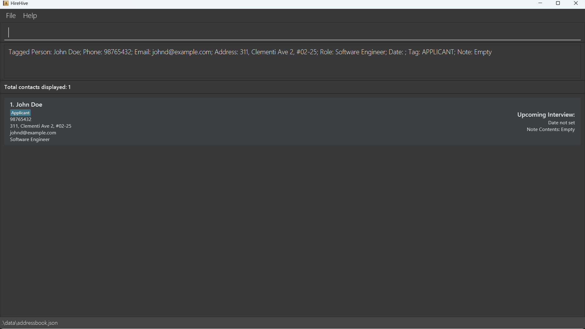

* `tag 1 t/Candidate` will tag the 1st applicant as "Candidate"
* `tag +1 n/John Doe` for a John Doe applicant with tag "Applicant" will tag them as "Candidate"

[Back to top](#welcome-to-hirehive)

### Add note to applicant: `newnote`

You can add information about the applicant into a note with this command.

Format: `newnote n/NAME i/NOTE`

* Adds the note if the given name partially matches **exactly one** applicant in the list ([case-insensitive](#glossary))
* If multiple matches are found, a list of all matching names will be displayed. You should then retry the command but using the **full name** of the desired applicant.
* NOTE has a limit of 500 characters.
* After adding, a popup window will appear containing the given input.
* If the input is empty or consists only of whitespace, then the popup window displays a default message "Currently empty..." in yellow.

Examples:
* `newnote n/John Doe i/25 years old` adds a note to John Doe that says "25 years old"

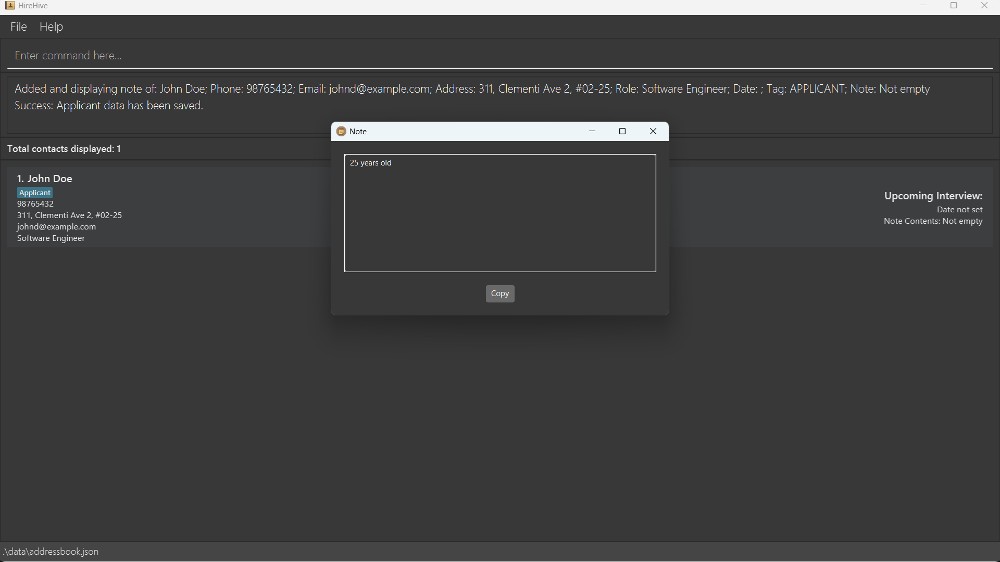

* `newnote n/John Doe i/` removes any existing content in John Doe's note

:bulb: **Tip:**
You can remove the contents of the note by leaving the NOTE field blank.

[Back to top](#welcome-to-hirehive)

### Schedule interview dates for applicants : `schedule`

Automatically or manually schedule your next interview with a potential candidate.

Format:

Command | Description
--------|------------------
`schedule n/NAME [id/DATE]` | Schedule interview date by name.
`schedule INDEX [id/DATE]` | Schedule interview date by index.

:bulb: **Tip:**
In the event where you are unable to select a candidate due to duplicated names, select them with their index instead!

* The date format is DD/MM/YYYY (date/month/year) e.g. "04/04/2025"
* The command will only accept dates starting from the current date.
* If date is left empty, the next day that does not have an interview after the current day will be used to schedule the meeting instead.
* You will have to provide a **positive [integer](#glossary)** to select a candidate by index.
* Scheduling an interview with an applicant or candidate will automatically change their tag to an Interviewee.

:exclamation: **Caution:**
You will not be allowed to schedule interviews with candidates that are already offered/rejected. Please change their tags if you wish to schedule a second interview.

Examples:
* Running `schedule n/John Doe id/01/01/2026` will schedule an interview with John Doe on 01/01/2026

* Running `schedule n/John Doe` on 01/01/2026 when there are no interviews scheduled will schedule an interview with 
  John Doe on 02/01/2026
* Running `schedule n/John Doe` on 01/01/2026 when there is an interview on 02/01/2025 will instead schedule the 
  interview with John Doe on 03/01/2026

[Back to top](#welcome-to-hirehive)

### <u>Listing applicant information</u>

### Display note of applicant: `displaynote`

You can display the note of an applicant with this command.

Format: `displaynote n/NAME`

* Displays the note if the given name partially matches **exactly one** applicant in the list ([case-insensitive](#glossary))
* If multiple matches are found, a list of all matching names will be displayed. You should then retry the command but using the **full name** of the desired applicant.
* A popup window will appear containing the applicant's note.
* If the input is empty or consists only of whitespace, then the popup window displays a default message "Currently empty..." in yellow.

Examples:
* `displaynote n/John Doe` shows John Doe's note

[Back to top](#welcome-to-hirehive)

### Sort applicants: `sort`

Sorts the applicants displayed on your screen by interview date, in chronological order so that you can conveniently view upcoming interviews.

Format: `sort`

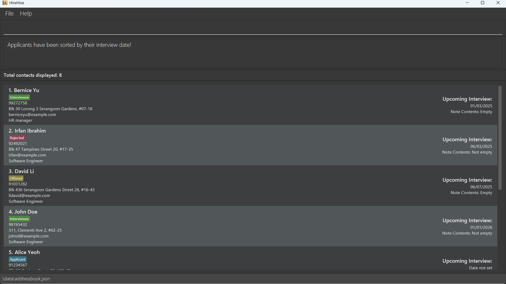

[Back to top](#welcome-to-hirehive)

### List all applicants: `list`

Shows you a list of all the applicants in HireHive so that you can look at an overview of all the applicants if needed.

:bulb: **Tip:**
This command also resets any filters applied by the commands below! 

Format: `list`

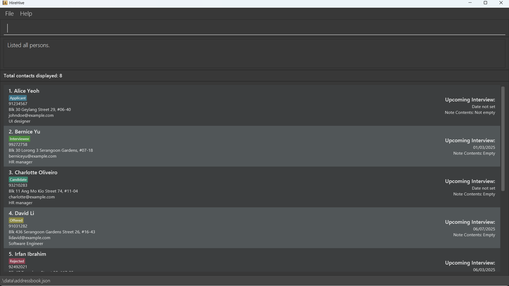

[Back to top](#welcome-to-hirehive)

### <u>Filtering applicant information</u>

The commands below are accumulative! Using one filter command after another will apply **both** filters to the applicant list. The filters will persist until other commands are used.

For example, running `filter t/interviewee` and `remind 5` will filter out all interviewees whose interviews are in 5 days.

### Filter applicants by tag: `filter`

You can view all your applicants with a specific tag for better organization!

Format: `filter t/TAG`

* The search is [case-insensitive](#glossary). e.g `applicant` will match `Applicant`
* Only full words will be matched e.g. `Reject` will not match `Rejected`

Examples:
* `filter t/Applicant` will filter and display everyone with the `Applicant` tag in the list

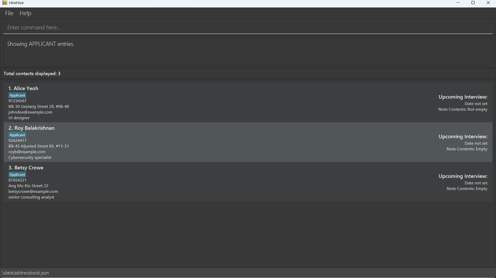

[Back to top](#welcome-to-hirehive)

### Filtering out applicants with tag: `filterout`
You can view all your applicants in a list **except** for those with the specified tag, for easier tracking of applicants!

Format: `filterout t/TAG`

* The search is [case-insensitive](#glossary). e.g `applicant` will match `Applicant`

Examples:
* `filterout t/offered` will filter out all applicants that were already offered the job, the remaining list will display applicants without the "Offered" tag.

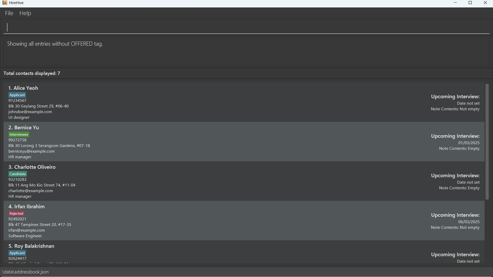

[Back to top](#welcome-to-hirehive)

### Show applicants with upcoming interviews: `remind`

Easily remind yourself of your upcoming interviews by listing down all applicants with interviews in the given days' time.

Format: `remind DAYS`

* `DAYS` is the number of upcoming days you wish to check for interviews for (inclusive).
* The number of days given must be a **non-negative [integer](#glossary)**, i.e. greater or equal to 0

Examples:

Given that today is 08/04/2025, and you have the following interviews scheduled:

- Alice Yeoh: 08/04/2025
- Bernice Yu: 10/04/2025
- Charlotte Oliveiro: 31/12/2025

* `remind 0` will display Alice's entry

* `remind 2` will display Alice's and Bob's entry

[Back to top](#welcome-to-hirehive)

### Find applicants by name: `find`
You can search for applicants whose names contain any of the given keywords!

Format: `find KEYWORD [MORE_KEYWORDS]`

* The search follows partial name matching. e.g. `find Han` will return `Han` and `Hans`
* The search is [case-insensitive](#glossary). e.g `hans` will match `Hans`
* The order of the keywords **matter**. e.g. `Hans Bo` will not match `Bo Hans`
* Only keywords in name are searched.

Examples:
* `find John` with an applicant John Doe in the list returns `John Doe`

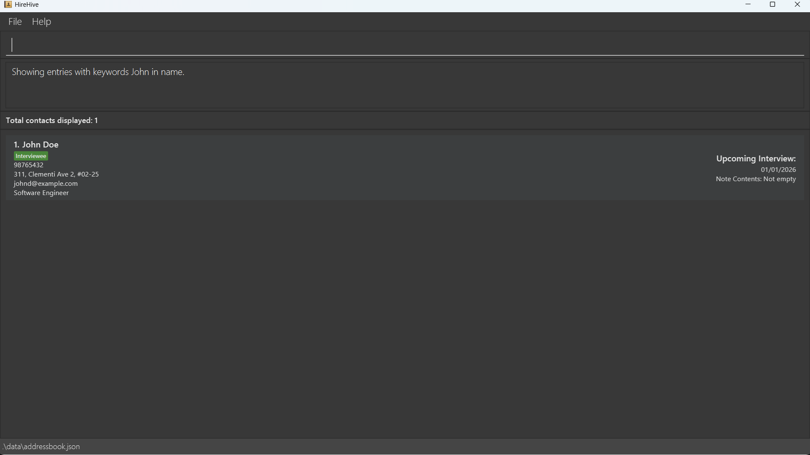

[Back to top](#welcome-to-hirehive)

### <u>Deletion of applicants</u>

### Delete an applicant: `delete`

You can delete a specific applicant from HireHive if their contact is no longer required.

Format: 

Command | Description
--------|------------------
`delete n/NAME` | Delete by name.
`delete INDEX` | Delete by index.

* Deleting by name will partially match to **exactly one applicant** in the list ([case-insensitive](#glossary)). 
  - If multiple matches are found, a list of all matching names will be displayed:
    - You can then enter the **full name** of the applicant you want to delete
    - **Or** you can delete by index of the displayed list
* Deleting by index must have a **positive** index number

Examples:
* `delete n/John Doe` deletes John Doe's contact from HireHive

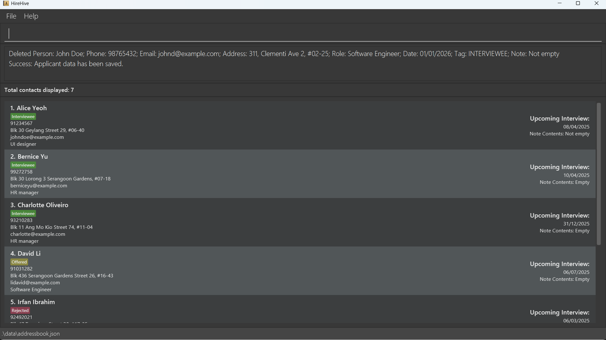

* `delete 2` deletes the second applicant in the list from HireHive

[Back to top](#welcome-to-hirehive)

### Clear all entries : `clear`

Clears all entries from HireHive.

Format: `clear`

:exclamation: **Caution:**
This action is **irreversible**! Please use this command with caution!

**:information_source: Note:** 
If you `clear` the data in HireHive and exit the app immediately, when you re-run HireHive, you will see a message on your screen warning you that the data might be corrupted. But not to worry! You may ignore this message and continue using HireHive as per normal.

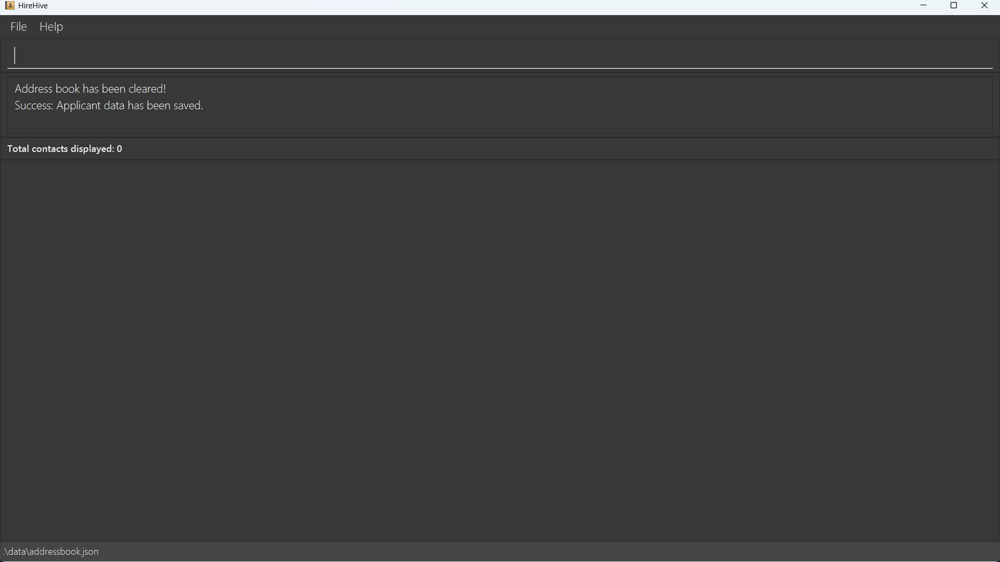

[Back to top](#welcome-to-hirehive)

### Exit the program : `exit`

You can use this command to exit the program once you are done using it.

Format: `exit`

[Back to top](#welcome-to-hirehive)

### Save the data

HireHive data is saved in the [hard disk](#glossary) automatically after any command that changes the data. If successfully saved, the output following the command will display the success message. There is no need to save manually.

[Back to top](#welcome-to-hirehive)

### Edit the data file

HireHive data are saved automatically as a [JSON](#glossary) file `[JAR file location]/data/addressbook.json`. Advanced users are welcome to update data directly by editing that data file.

:exclamation: **Caution:**
If your changes to the data file makes its format **invalid**, HireHive will start with an **empty** data file at the next run. It will **discard** the old invalid data after the first successful command during this run. Hence, it is recommended to take a backup of the file before editing it. 
Furthermore, certain edits can cause HireHive to behave in unexpected ways (e.g., if a value entered is outside the acceptable range, or it is not of the expected data type). Therefore, edit the data file only if you are confident that you can update it correctly.

[Back to top](#welcome-to-hirehive)

--------------------------------------------------------------------------------------------------------------------

## FAQ

**Q**: How do I transfer my data to another Computer? 
**A**: Install the app in the other computer and overwrite the empty data file it creates with the file that contains the data of your previous HireHive home folder.

[Back to top](#welcome-to-hirehive)

--------------------------------------------------------------------------------------------------------------------

## Known issues

1. **When using multiple screens**, if you move the application to a secondary screen, and later switch to using only the primary screen, the [GUI](#glossary) will open off-screen. The remedy is to delete the `preferences.json` file created by the application before running the application again.
2. If you **minimize the Help Window and then run the `help` command** (or use the `Help` menu, or the keyboard [shortcut](#glossary) `F1`) again, the original Help Window will remain minimized, and no new Help Window will appear. The remedy is to manually restore the minimized Help Window.

[Back to top](#welcome-to-hirehive)

--------------------------------------------------------------------------------------------------------------------

## Glossary

Term | Description
--------|------------------
**Alphanumeric** | Consisting of both letters (A to Z) and numbers (0 to 9).
**Applicant** | A person who makes a formal application for something, especially a job.
**Case-insensitive** | Uppercase and lowercase letters are treated the same and hence equivalent.
**Graphical User Interface (GUI)** | A form of user interface that allows users to interact with electronic devices through graphical icons and visual indicators such as secondary notation.
**Hard disk** | The storage device used by a computer. These can be used as primary or secondary storage.
**Integer** | A whole number within the range of -231 and 231 inclusive.
**JSON** | Acronym for _JavaScript Object Notation,_ an open standard file format and data interchange format that uses human-readable text to store and transmit data objects consisting of name–value pairs and arrays (or other serializable values).
**Shortcut** | A key or combination of keys that you can press on a computer keyboard to quickly perform a specific action.
**Unique** | Only 1 specific instance of it exists.

[Back to top](#welcome-to-hirehive)

--------------------------------------------------------------------------------------------------------------------
