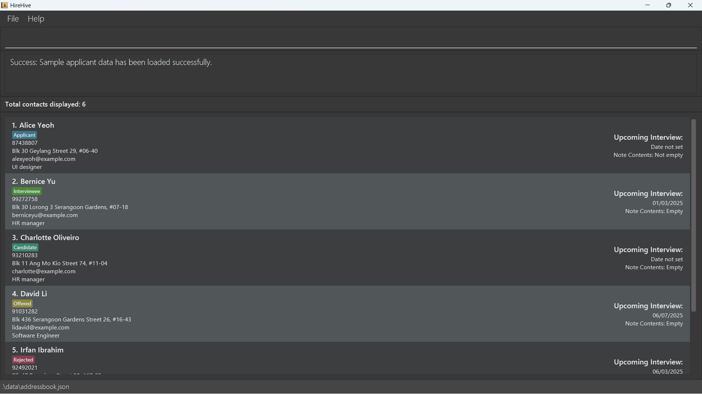

HireHive is your **personal, all-in-one** hiring assistant designed to simplify the hiring process so you can focus on what matters most - finding the best talent.

* If you are interested in using HireHive, head over to the [_Quick Start_ section of the **User Guide**](UserGuide.html#quick-start).
* If you are interested about developing HireHive, the [**Developer Guide**](DeveloperGuide.html) is a good place to 
  start.

**Acknowledgements**

* Libraries used: [JavaFX](https://openjfx.io/), [Jackson](https://github.com/FasterXML/jackson), [JUnit5](https://github.com/junit-team/junit5)
